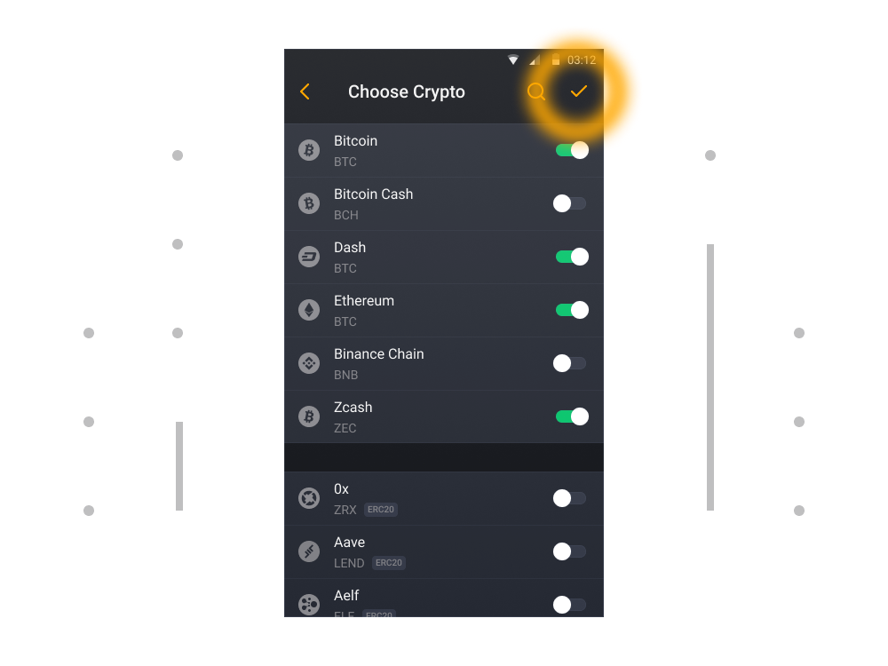

# Wie erstellt man ein Multi-Coin-Wallet?

1. Starten Sie Unstoppable Wallet (Beim ersten Start der Wallet-App wird Ihnen der untenstehende Bildschirm angezeigt, in welchem Sie ein „Wallet Erstellen“ oder ein bereits vorhandenes Wallet „Wallet Wiederherstellen“ können. Für diesen Leitfaden wählen wir „Wallet Erstellen“).

2. Wählen Sie die Kryptowährungen aus, die Sie verwenden möchten, und klicken Sie auf die Schaltfläche „Erstellen“ oben auf dem Bildschirm. Das Wallet wird Wallets nach den empfohlenen Standards erstellen.

3. Das Wallet wurde erstellt!

