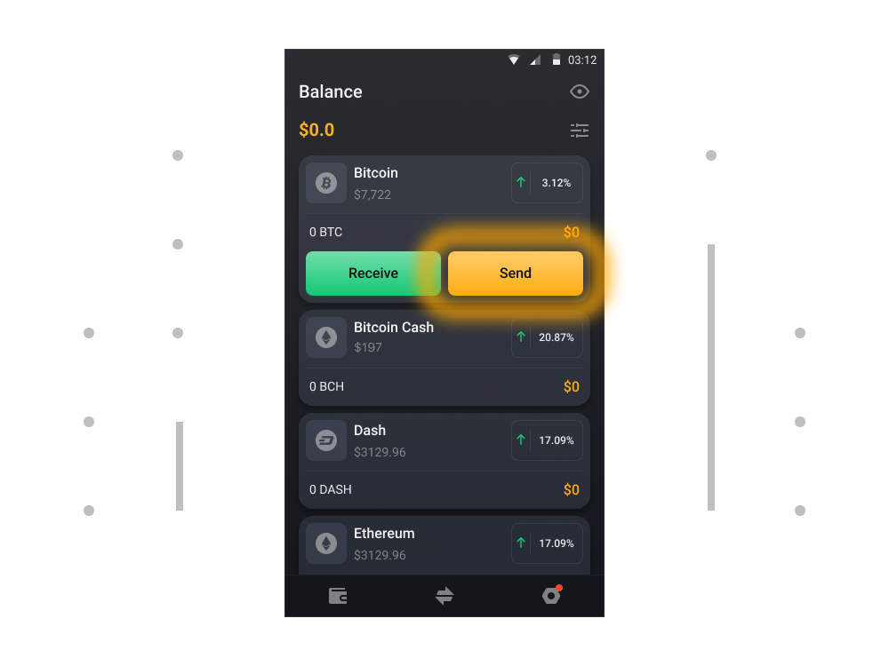
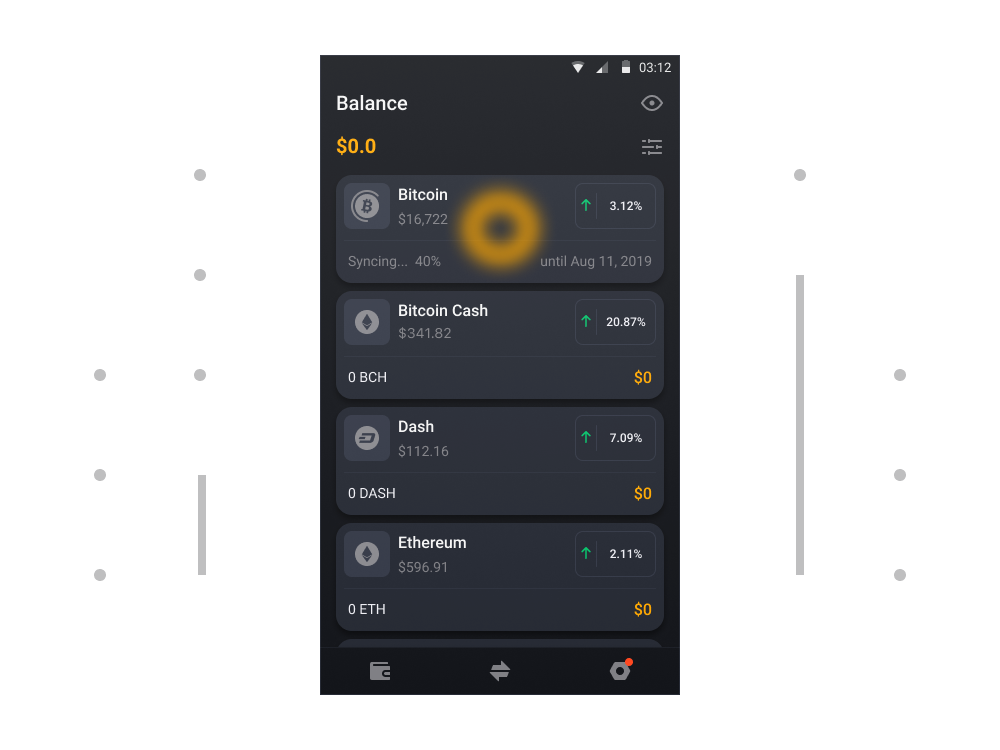
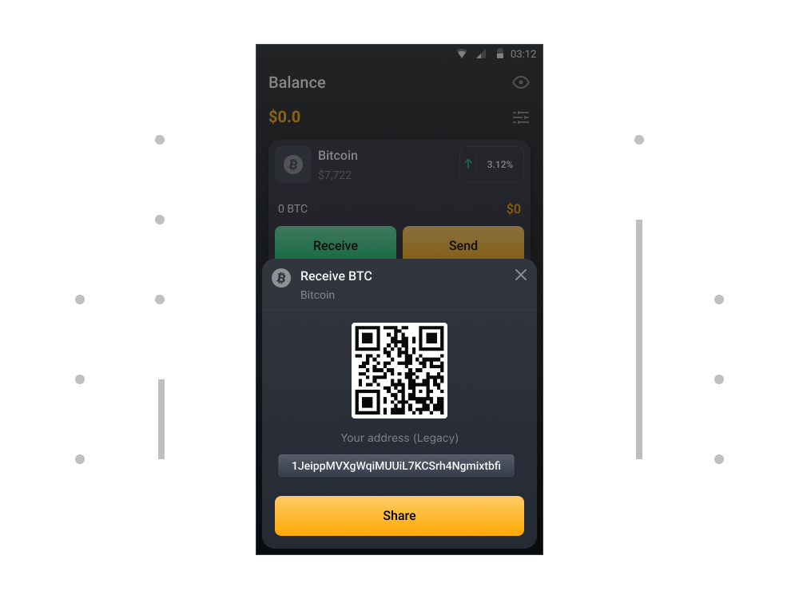

# Wie sendet und empfängt man Kryptowährung?

### Um Kryptowährung zu senden

1. Tippen Sie auf der Registerkarte Guthaben auf Token (das Token, das Sie senden möchten).

2. Tippen Sie nun auf die Schaltfläche Senden auf der rechten Seite Ihres Wallets.

3. Geben Sie die Anzahl der Token und die Krypto-Adresse der Person ein, der Sie die Kryptowährung senden möchten. Wählen Sie Weiter, um die Einzelheiten dieser Übermittlung zu überprüfen und zu bestätigen.

4. Überprüfen Sie Adresse und Betrag, prüfen Sie die Gebühren und bestätigen Sie den Versand.

### Um Kryptowährung zu empfangen

1. Tippen Sie auf der Registerkarte Guthaben auf Token (das Token, das Sie erhalten möchten).

2. Tippen Sie nun auf die Schaltfläche Anfordern auf der linken Seite Ihres Wallets.

3. Hier sehen Sie Ihre Adresse als einfachen Text und als QR-Code. Sie können diese Adresse verwenden, um Gelder zu empfangen.

