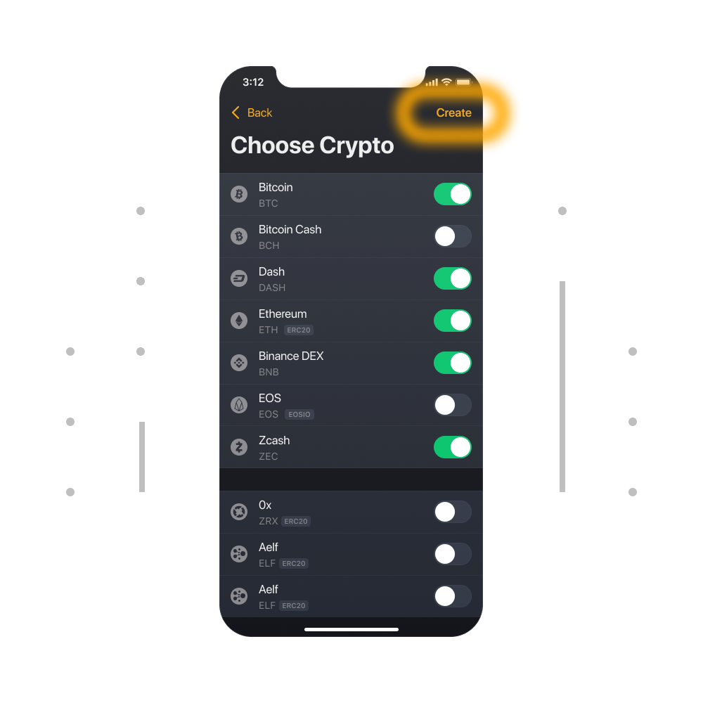

# ¿Cómo crear un monedero multimoneda?

1. Iniciar la Unstoppable Wallet (Con el primer inicio de la aplicación, se presentara una pantalla cuya parte inferior es donde podrás “Crear un nuevo Monedero” o “importar” un monedero existente. Para esta guía, vamos a seleccionar “Crear un nuevo monedero”)

2. Para elegir criptomonedas necesitarás usar y hacer click en el botón de crear en la parte superior de la pantalla. El monedero creará monederos para los estándares recomendados. 

3. ¡El monedero ya está creado!

