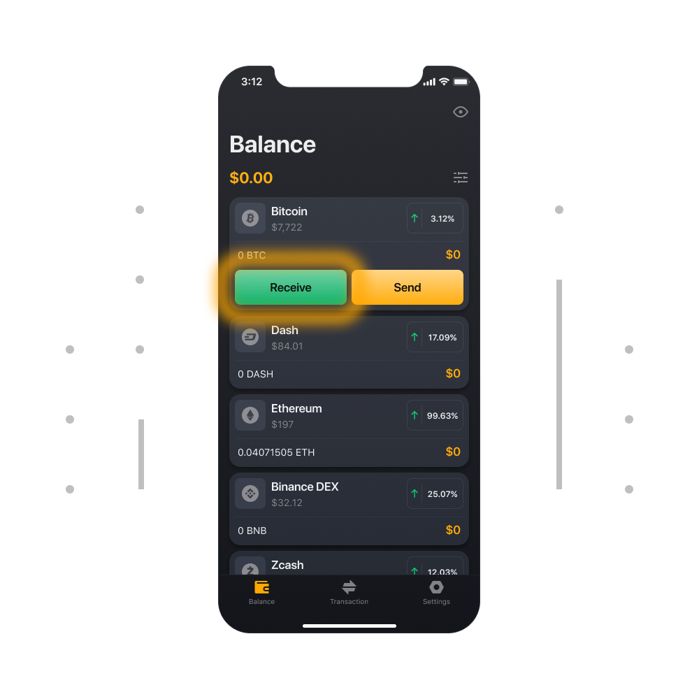

# ¿Cómo envío y recibo cripto monedas?

### Para enviar Criptomonedas

1. Haga clic en el token en la pestaña de Balance (El token que usted necesite enviar).

2. Ahora haga clic en el botón de Enviar en la parte de la mano derecha de su monedero.

3. Ingrese la cantidad de tokens y la dirección de cripto de la persona que usted le quiere enviar la criptomoneda. Seleccione Siguiente para revisar y confirmar los detalles del envío

4. Verifique la dirección y el monto, verifique el costo de la tarifa y  confirme el envío.

### Para recibir Criptomoneda

1. Haga clic en el token en la pestaña de Balance (El token que usted necesite recibir).

2. Ahora haga clic en el botón de Recibir  de la mano izquierda de su monedero.

3. Aquí usted podrá ver su dirección en un texto común y en un código QR. Usted puede usar esta dirección para recibir fondos.

