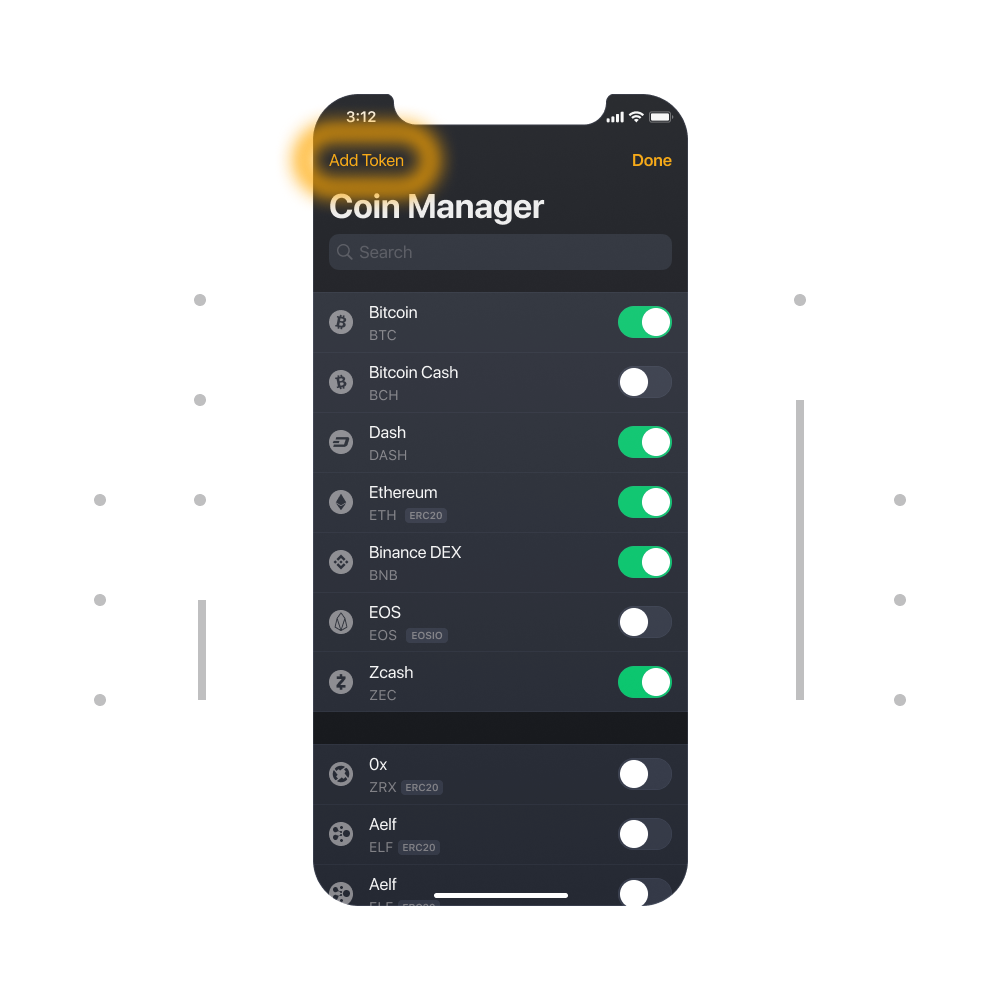
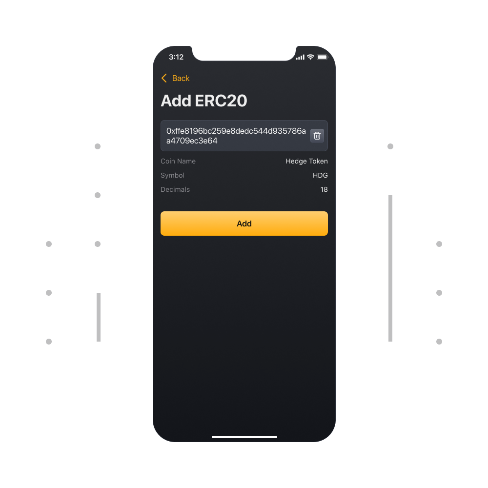

# Как добавить или удалить криптовалюту или токен?
  
Во вкладке "Баланс", вы найдете кнопку "Добавить валюты" в конце списка криптовалют. Нажмите на эту кнопку и добавьте или удалите криптовалюты из списка.

### Как добавить криптовалюту вручную?

Если вы не нашли нужную вам валюту, то вы можете добавить ее вручную. Нажмите на кнопну "Добавить токен" в верхней части экрана, чтобы добавить контрактный адрес токена.

На данный момент, приложение может добавлять только токены, соответствующие стандарту ERC20.

