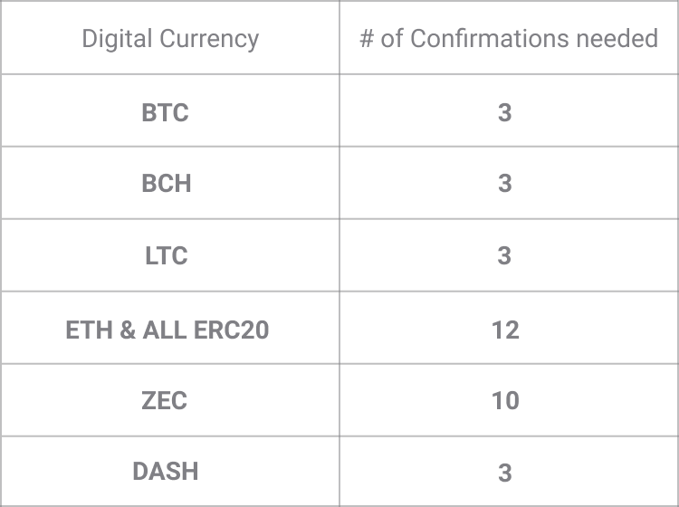

# Почему моя транзакция находится в "ожидании"?

Входящие транзакции отображаются в вашем аккаунте практически мгновенно (в течении нескольких секунд), но их статус будет высвечиваться как "В ожидании", до тех пор, пока не будет набрано достаточное количество подтверждений в сети. Количество необходимых подтверждений зависит от цифровой валюты.

Как только транзакция подтверждена, ее статус сменится на "Завершена" и высветится зеленым цветом. Это дает вам понять, что транзакция стала необратимой и средства могут быть сняты.

Время от времени, транзакции не принимаются остальными участниками сети и, таким образом, никогда не считаются "подтвержденными".

**Основные причины неподтверждения транзакций**

- Отправка весьма малой суммы с установлением незначительной сетевой ставки.  Все транзакции в Биткоинах требуют подтверждения майнерской ставки сетью блокчейна Биткоин. При отправке Биткоина, вам придет запрос на установление майнерской ставки, с тем чтобы транзакция была подтверждена. Если установлена незначительная ставка, ваша транзакция может навсегда остаться неподтвержденной.
- Сеть перегружена большим количеством транзакций. Иногда по всему миру отправляется очень большой объем цифровой валюты и количество транзакций может превышать количество доступного места в каждом новом блоке, чтобы добавить транзакцию.

