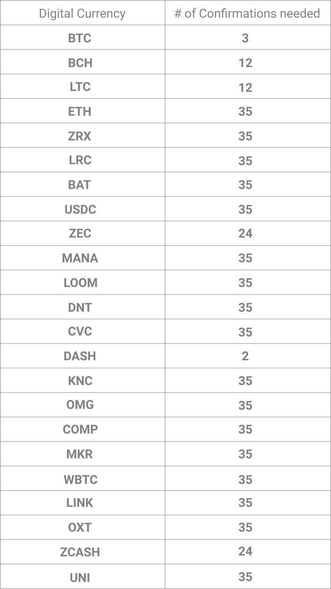

# İşlemim neden 'beklemede'?

Gelen işlemler, hesabınızda neredeyse anında (birkaç saniye içinde) görünür, ancak yeterli ağ onaylamaları olana kadar 'Beklemede' olarak görünecektir. Gerekli onayların sayısı dijital para birimine bağlıdır.

Bir işlem doğrulandığında, yeşil renkte Tamamlandı olarak görünecektir. Bu, işlemin tersine çevrilemeyeceğini ve paranın çekilebileceğini bilmenizi sağlar.

Bazen işlemler ağın geri kalanı tarafından kabul edilmez ve bu nedenle hiçbir zaman "onaylanmış" olarak kabul edilmez.

**Onaylanmamış işlemlerin yaygın nedenleri**

- Yetersiz ücretlerle çok küçük bir miktar göndermek. Tüm bitcoin işlemleri, bitcoin ağı tarafından onaylanması için bir madenci ücreti gerektirir. Bitcoin gönderirken, işlemin onaylandığından emin olmak için bir madenci ücreti eklemeniz istenecektir. Yetersiz bir ücret dâhil edilirse, işleminiz asla onaylanmayabilir.
- Ağda yüksek hacim durumu. Bazen küresel olarak gönderilen yüksek hacimli dijital paralar olur ve her yeni blokta işlemi içerecek alandan daha fazla işlem vardır.

