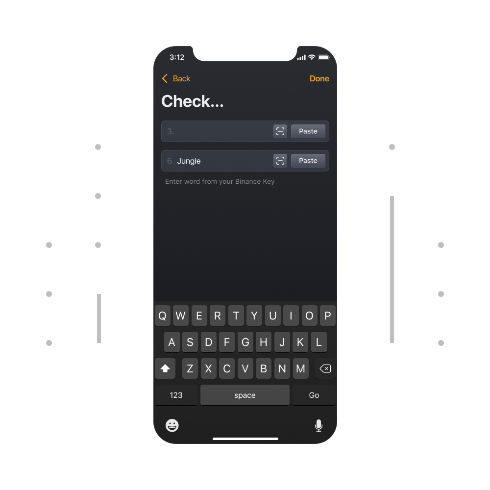

# How to backup your wallet(s)?

### Why Backup?

- ***Keep your funds secure***
- ***Restore** **your wallet on any device***
- ***Prevent loss of funds***
- ***You are responsible for keeping private keys safe***

**This is an important reminder to always do a manual backup of your wallet.**

Your **Private Keys** are stored encrypted on your device and never leave your device. What this means is that, your keys are secured. The best way to backup your wallet is by manually writing down your Private Key on piece of paper. Thus, **no online service can then capture your wallet information.**

The Unstoppable Wallet team has NO record of your Private Keys.

### How to Backup?

Simply go to the Settings menu then tap on "Manage Wallets", there you will see "Backup" button for each wallet you have.

### Backup Your Private Keys

Your private keys are generated as soon as you create a Multi-Coin wallet. You need to backup your private keys as soon as possible.

This is your keys it might be 12 or 24 words. , write it down on paper and keep it safe. After than check your backup on the next page

**Done!**

**Lost Backup?**

- Please make sure you store your backup(s) in a safe place.
- We at Unstoppable Wallet, have **NO access** to your wallet or your Private Keys.
- **Without a backup, your funds are lost. We cannot help you.**
