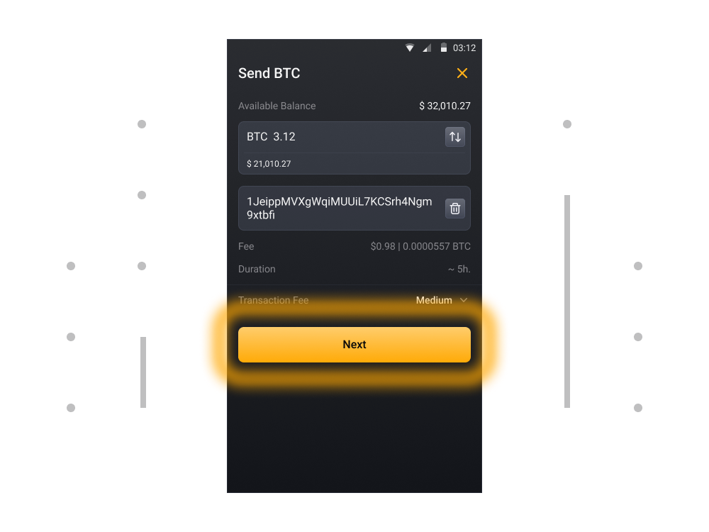
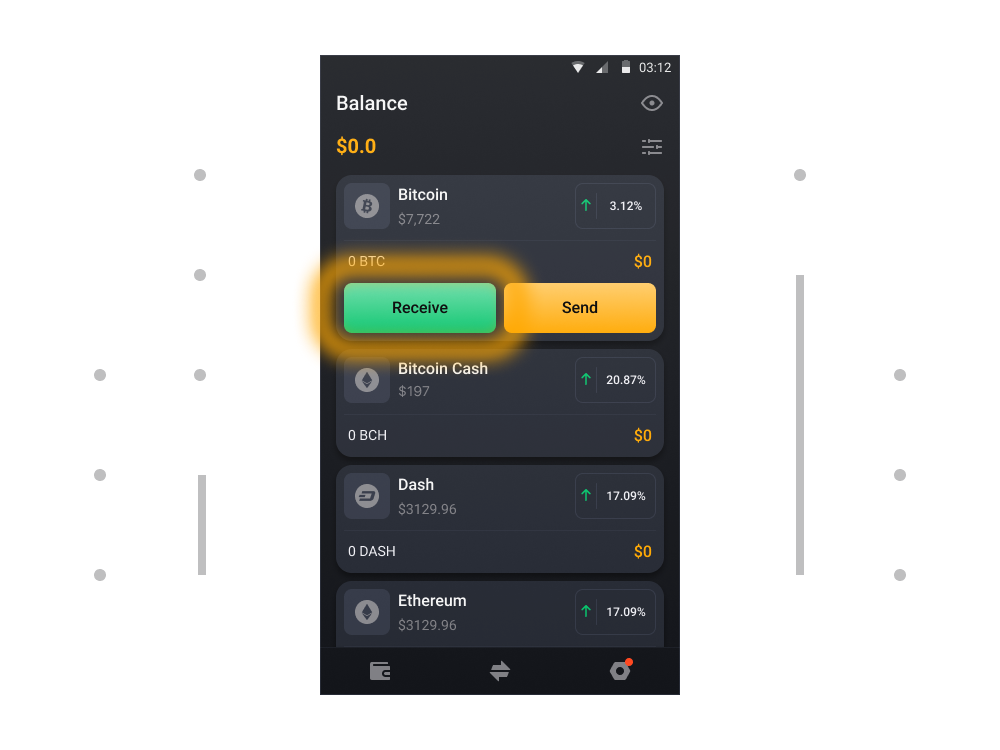

# How to send and receive cryptocurrency?

### To Send Cryptocurrency

1. Tap on token on Balance tab (the token you need to send)

2. Now tap on the Send button on the right hand side of your wallet

3. Enter amount of tokens and the crypto address of the person you would like to send the crypto. Select Next to review and confirm the details of this send.

4. Check the address and amount, check fee cost and confirm sending

### To Receive Cryptocurrency

1. Tap on token on Balance tab (the token you need to receive)

2. Now tap on the Receive button on the left hand side of your wallet

3. Here you will see your address in plain text and as a QR code. You can use this address to receive funds.

