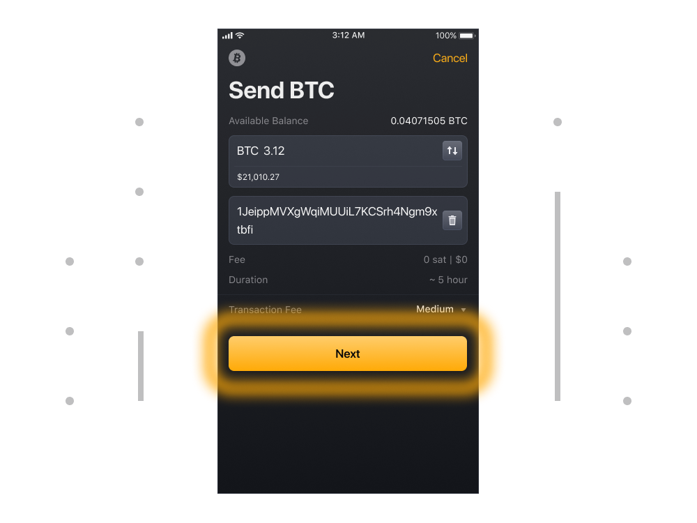
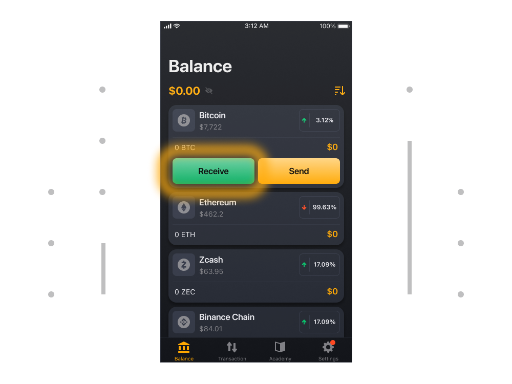
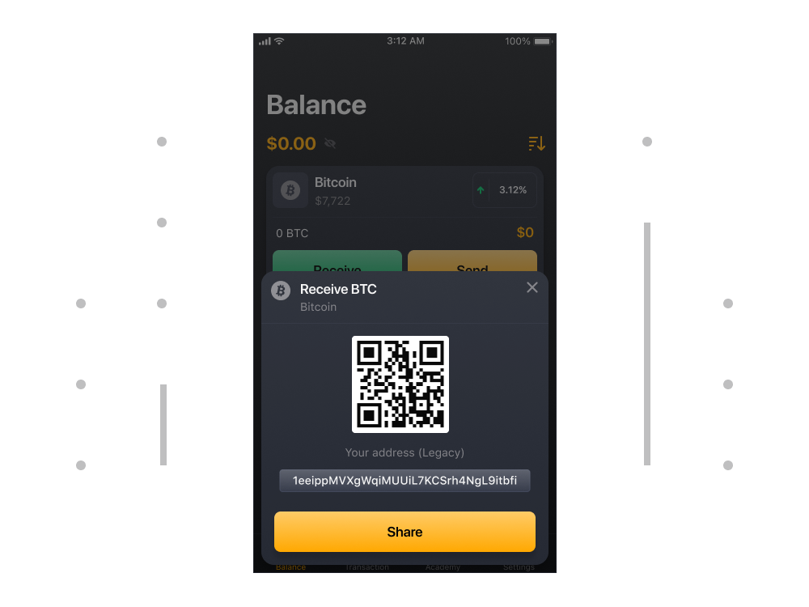

# Comment envoyer et recevoir de la cryptomonnaie ?

### Pour envoyer de la cryptomonnaie

1. Sélectionnez le token sur l'onglet Solde (le token que vous devez envoyer).

2. Puis sélectionnez le bouton Envoyer à droite de votre portefeuille.

3. Entrez le nombre de jetons et l'adresse cryptographique de la personne à qui vous souhaitez envoyer la crypto. Sélectionnez Suivant pour vérifier et confirmer les détails de cet envoi.

4. Vérifiez l'adresse et le montant, vérifiez le coût des frais et confirmez l'envoi.

### Recevoir de la crypto-monnaie

1. Sélectionnez le token sur l'onglet Solde (le token que vous devez recevoir).

2. Maintenant, appuyez sur le bouton Recevoir sur le côté gauche de votre portefeuille.

3. Là, vous verrez votre adresse en texte clair et sous forme de code QR. Vous pouvez utiliser cette adresse pour recevoir des fonds.

