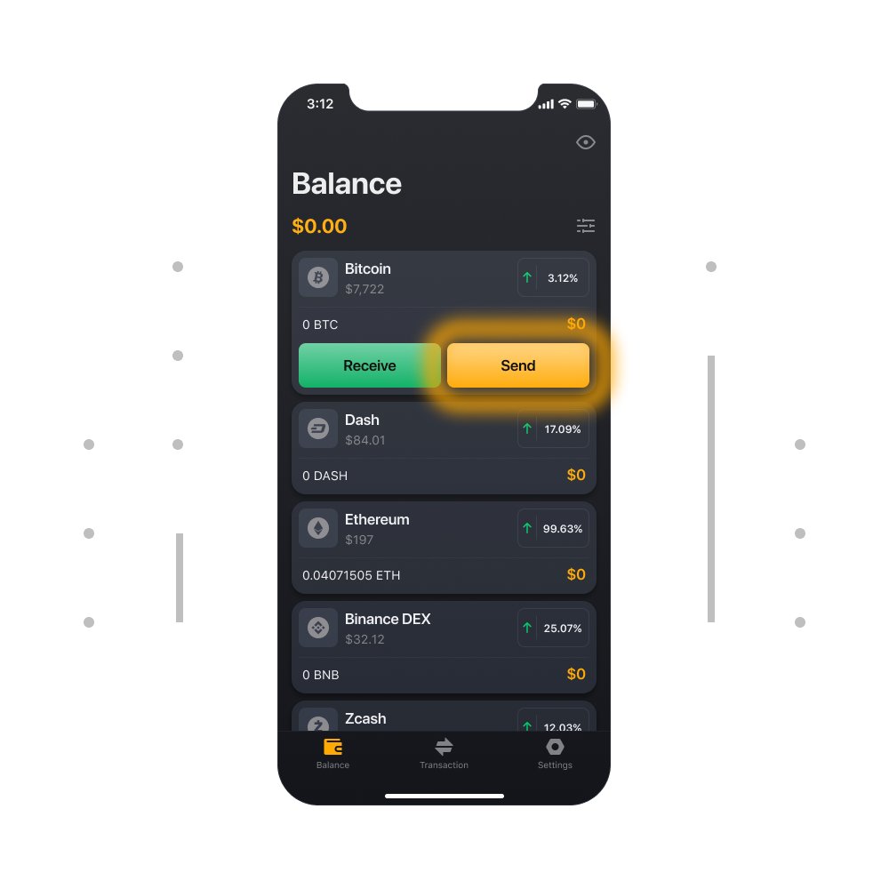
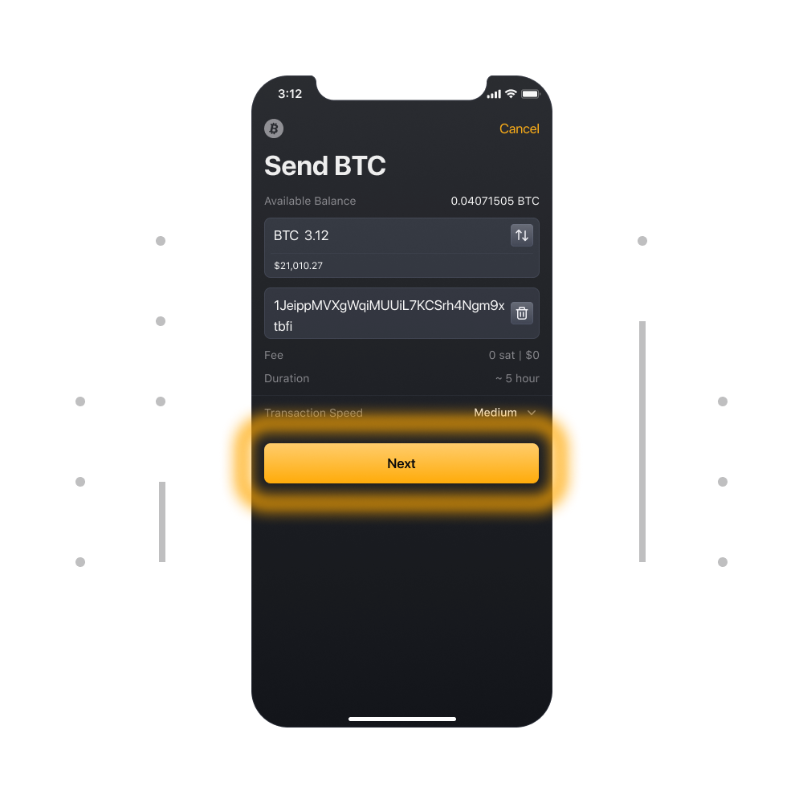
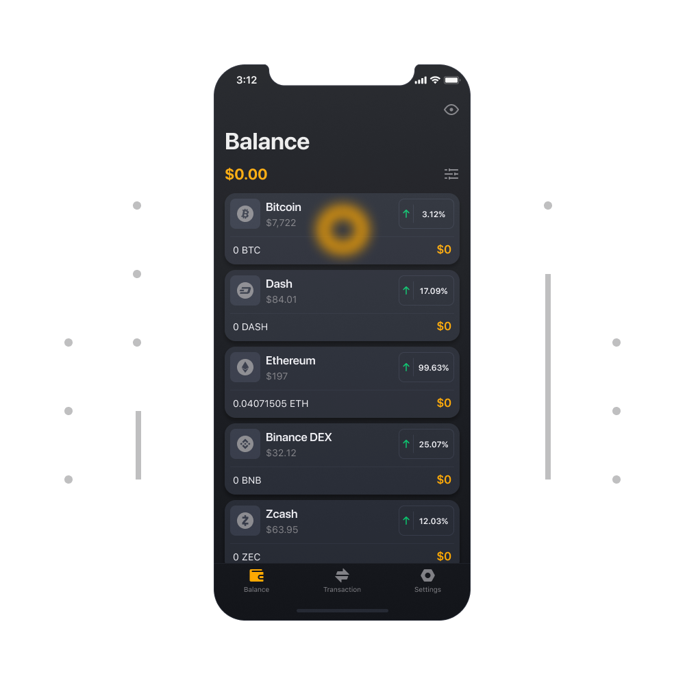
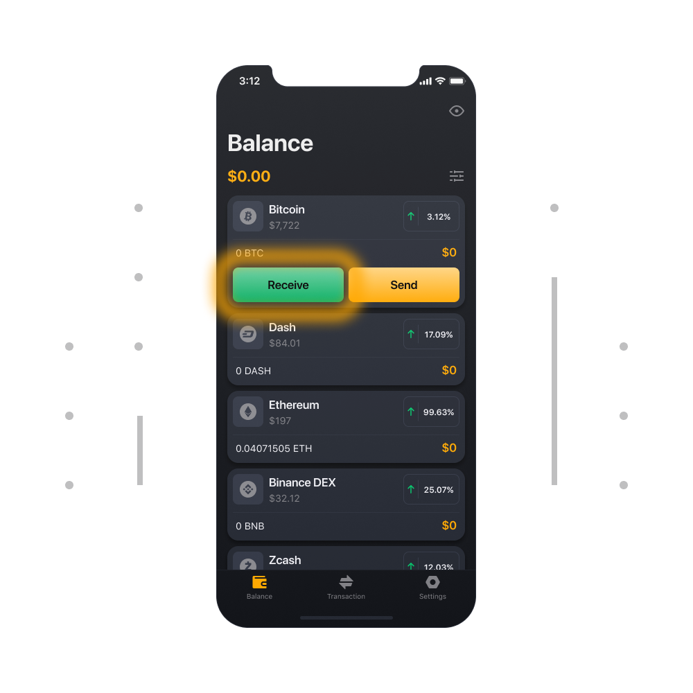
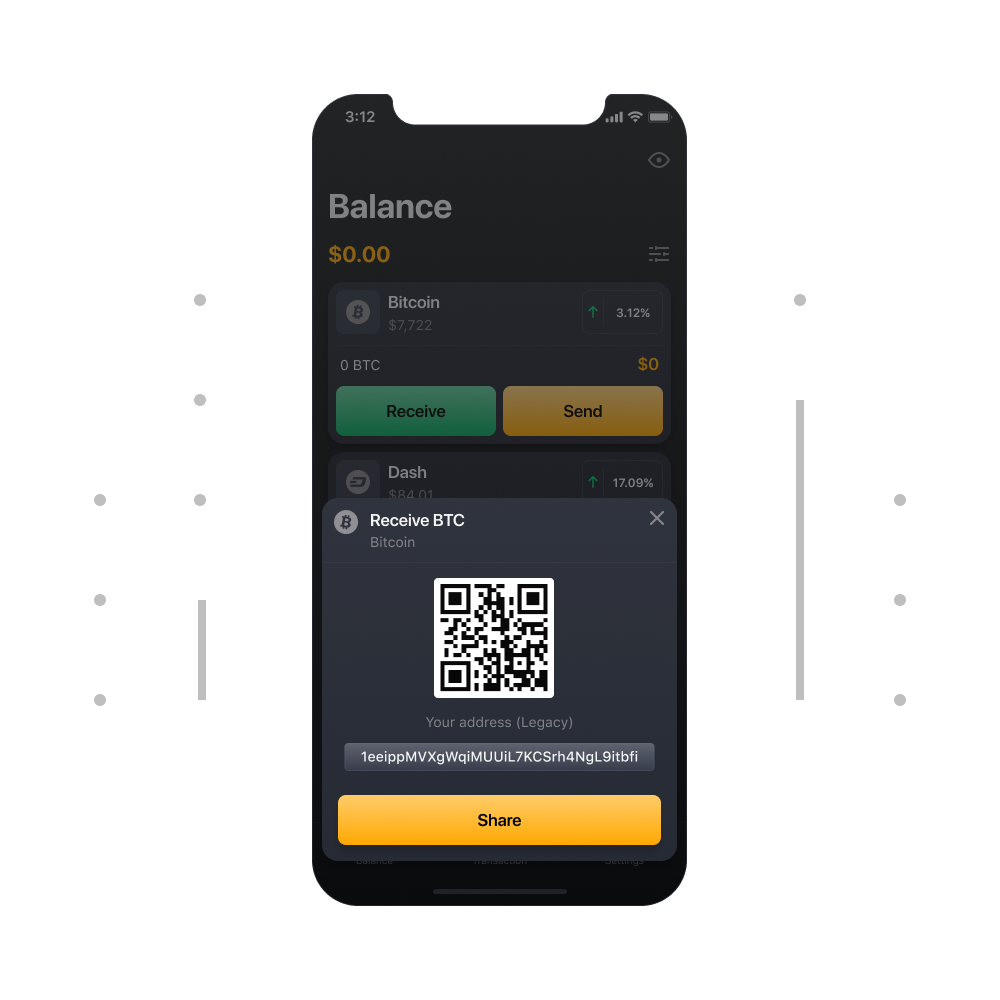

# Kripto para nasıl gönderilir ve alınır?

### Kripto Para Göndermek İçin

1. 	Bakiye sekmesindeki token seçeneğini tıklayın (göndermeniz gereken token).

2. Şimdi cüzdanınızın sağ tarafındaki Gönder butonunu tıklayın.

3. Token miktarını ve kripto göndermek istediğiniz kişinin kripto adresini girin. Bu gönderimin ayrıntılarını gözden geçirmek ve onaylamak için İleri'yi seçin.

4. Adresi ve miktarı kontrol edin, hizmet karşılığı ücreti kontrol edin ve gönderimi onaylayın.

### Kripto Para Almak İçin

1. Bakiye sekmesindeki token seçeneğini tıklayın (almanız gereken token)

2. 	Şimdi cüzdanınızın sol tarafındaki Al butonunu tıklayın

3. 	Burada adresinizi düz metin ve QR kodu olarak göreceksiniz. Fonlarınızı almak için bu adresi kullanabilirsiniz.

