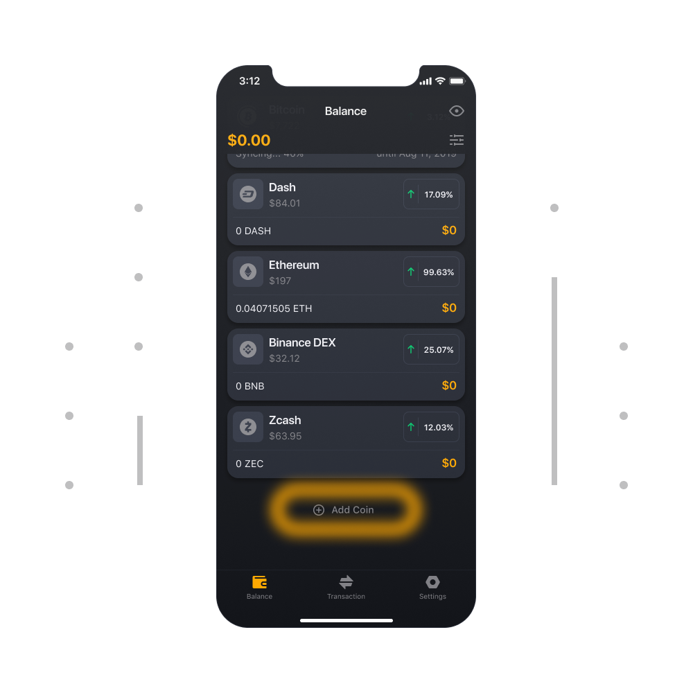
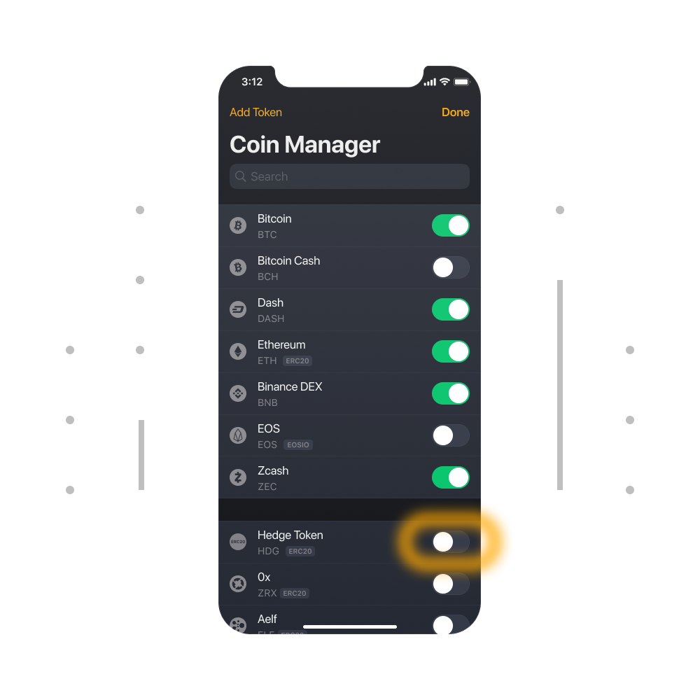

# Comment ajouter et supprimer une pièce ou un token ?
  
Sur l'onglet Solde, vous verrez le bouton " Ajouter des pièces " à la fin de la liste des pièces. Sélectionnez le bouton et activez ou désactivez les pièces de la liste.

### Comment ajouter une pièce manuellement ?

Si vous ne trouvez pas votre pièce, vous pouvez l'ajouter manuellement. Cliquez sur le bouton Ajouter un token en haut de l'écran pour entrer l'adresse du contrat de token

Maintenant, nous ne pouvons ajouter que des tokens ERC20.

